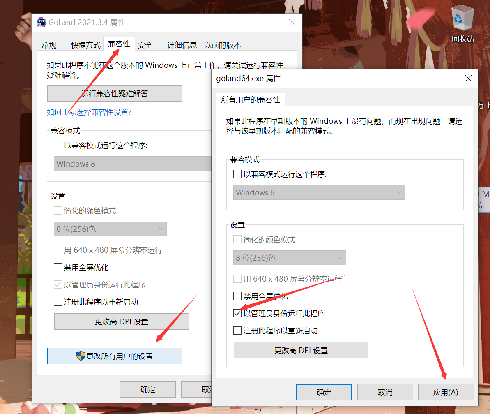

之前有一直听说微服务，GRPC也没有怎么了解，昨天刷到一个bilibili的视频：[用Java手撸一个简单的RPC框架｜一个写C++的在看完gRPC后用Java手撸了个简单的RPC框架](https://www.bilibili.com/video/BV1ZF411575U)，感觉挺不错的。

关于RPC：https://www.topgoer.com/微服务/RPC.html

gRPC快速入门：https://www.liwenzhou.com/posts/Go/gRPC/

遇到的问题：

- GoLand 终端无法识别系统环境变量path
  - 关于这个问题我之前在使用vscode的时候也遇到过，我之前在解决的时候大部分博客都是说把Shell 路径改成 cmd 的路径，但是只是部分有用，需要通过管理员身份打开编辑器。
  
[从GOPATH到GOMODULES](https://juejin.cn/post/7052887388707618829)
[go get](https://xueqing.github.io/translation/go-doc/command/get/)

以管理员身份运行之后，一直有个弹窗，把弹窗的安全等级设置为最低就好了2233。
